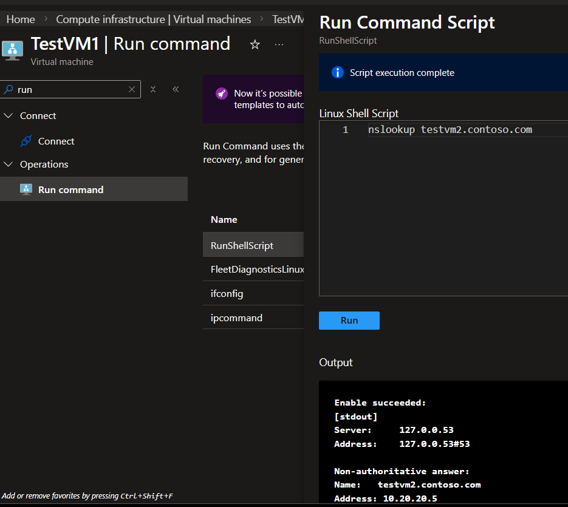
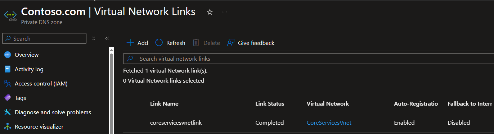
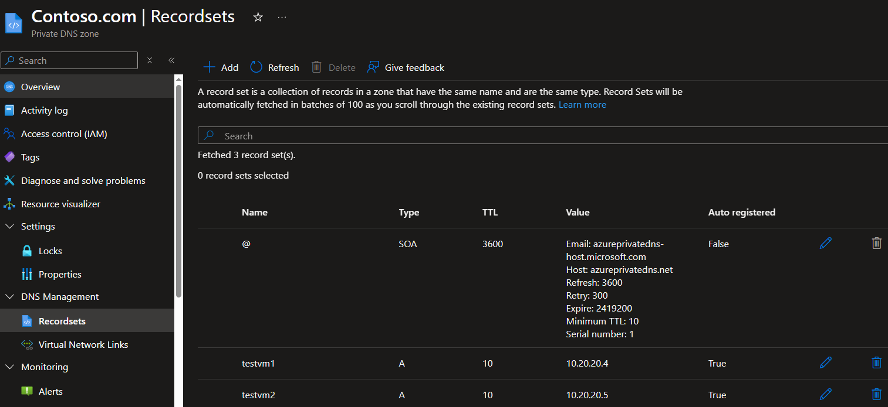

# 06: Designing and Implementing Name Resolution

### **Technical Objective**
Establish reliable, private FQDN resolution within a virtual network environment to prevent internal infrastructure exposure to the public internet and ensure seamless service connectivity.

### **Reference Documentation**
*   [Microsoft Learning: Configure DNS settings in Azure (Lab)](https://microsoftlearning.github.io/AZ-700-Designing-and-Implementing-Microsoft-Azure-Networking-Solutions/Instructions/Exercises/M01-Unit%206%20Configure%20DNS%20settings%20in%20Azure.html)
*   [Microsoft Learn: Exercise - Configure DNS Settings (Module)](https://learn.microsoft.com/en-us/training/modules/introduction-to-azure-virtual-networks/6-exercise-configure-domain-name-servers-configuration-azure)

### **Architectural Pivot: Region & Quota Management**
*   **Regional Sanctuary:** Successfully pivoted deployment to **`norwayeast`** to bypass strict `NotAvailableForSubscription` SKU restrictions encountered in `eastus` and `westeurope`.
*   **SKU Selection:** Optimized for 12-month free-tier eligibility using **`Standard_B2ats_v2`** (AMD-based burstable).
*   **Quota Strategy:** 
    *   **TestVM1:** Deployed with **Spot** priority (utilizing the 3-core `LowPriorityCores` regional limit).
    *   **TestVM2:** Deployed with **Regular** priority to bypass the 3-core Spot ceiling, allowing concurrent execution of **4 total vCPUs** within the standard regional limit.

### **Implementation Checklist**
- [x] Deployment of Azure Private DNS Zone (`contoso.com`) in Norway East.
- [x] Virtual Network Link configuration between `CoreServicesVnet` and the Private DNS Zone.
- [x] **Auto-registration** of internal host A-records for `TestVM1` and `TestVM2`.
- [x] Verification of split-horizon DNS functionality via internal resolution.

### **Security Validation (The Evidence)**

#### **1. Resolution Proof (nslookup)**
*Verification of the DNS resolver returning the internal Private IP instead of a public endpoint.*

#### **2. Infrastructure Configuration**
*Confirmation of the Private DNS Zone linked status to the target VNet with Auto-Registration enabled.*

#### **3. Dynamic Recordsets**
*Verification of the automated A-record generation for ephemeral and persistent internal hosts.*

### **Analyst Perspective**
By implementing Private DNS Zones, we eliminate the need for host-file manipulation and reduce the attack surface by ensuring internal resource names are only resolvable within authorized network segments. Navigating regional SKU availability and quota tiers during this lab highlights the real-world requirement for **Capacity Planning** and **Regional Redundancy** in Azure network architecture. This configuration is a prerequisite for mitigating DNS-based exfiltration and lateral movement.
