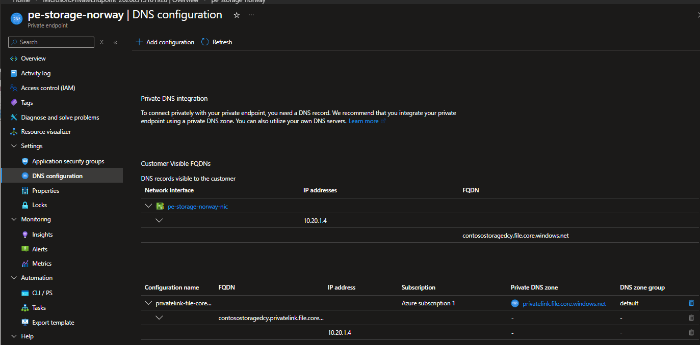
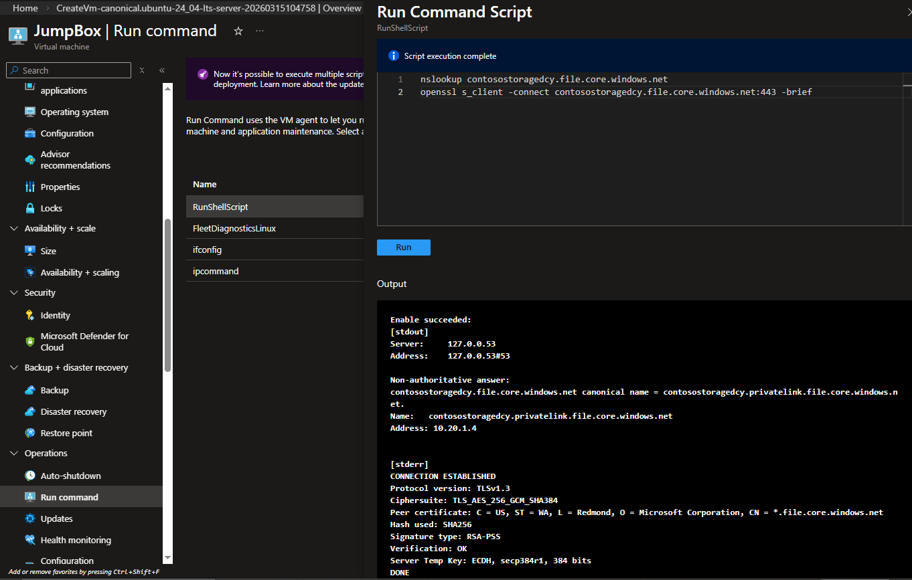

# Unit [U05]: PaaS Access via Service Endpoints 🛡️
**Status:** 🟢 Verified | **Module:** M07 | **Date:** 2026-03-14

## 🏗️ Project Architecture
Hardened an Azure Storage Account by Enforcement of a "Secret Tunnel" (Service Endpoint) for VNet-internal traffic while dropping the "Iron Curtain" on the public internet.

*Figure 1: CoreServicesVNet architecture with isolated Private Subnet.*

## 🛠️ Customization Choices
*   **Dual-OS Pivot:** Deployed **Ubuntu 24.04** and **Windows Server 2022** (Spot) to validate cross-platform parity.
*   **Incident Response:** Performed an emergency **Key Rotation** (regenerated access keys) after credentials were leaked in console logs to maintain environment integrity.

## 🎯 Implementation Testing
*   **Phase 1 (Baseline):** Verified the initial path from **UbuntuVM (10.20.0.4)** to the vault via `nc`.
    
*   **Phase 2 (Infrastructure):** Enabled the **Storage Service Endpoint** on the Subnet and locked the **Storage Firewall** to "Selected Networks."
    
*   **Phase 3 (Remediation):** Rotated the compromised Storage Account Key and purged the exposed credentials.
    

## 🚀 Proof of Work
Verified authorized internal tunnel access while simultaneously confirming public internet lockout.

*Figure 2: WinScout Success vs. Local PC Access Denied (Error 5).*

---

# Unit [U06]: Private Link & Private Endpoints 🔒
**Status:** 🟢 Verified | **Module:** M07 | **Date:** 2026-03-15

## 🏗️ Project Architecture
Evolved the "Locked Gate" architecture (Service Endpoints) into a "Hidden Door" (Private Link). Completely decommissioned the Storage Account's public IP footprint and assigned a non-routable internal IP (**10.20.1.4**) directly to the vault.

*Figure 1: CoreServicesVNet (Norway East) - Tiered Subnet Isolation Architecture.*

## 🛠️ Customization Choices
*   **Infrastructure as Code (IaC):** Deployed a **Modular ARM Template** (JSON) for the 2-Tier VNet and Jumpbox to maintain environment consistency.
*   **DNS Sovereignty:** Integrated a **Private DNS Zone** (`privatelink.file.core.windows.net`) to intercept public URI requests and redirect them to the internal 10.20.1.x range.
*   **Protocol Hardening:** Forced all management traffic through a hardened **Ubuntu 24.04 LTS Jumpbox** (10.20.0.4) to bridge the gap into the Private Subnet.

## 🎯 Implementation Testing
*   **Phase 1 (The Kill-Switch):** Hardened the Storage Networking blade by setting Public Network Access to **Disabled** (100% internet lockout).
*   **Phase 2 (The Tunnel):** Provisioned a **Private Endpoint** (NIC) into the `PrivateSubnet`, mapping the `file` sub-resource to a private internal IP.
    
*   **Phase 3 (Logic Verification):** Performed a brief **SSL Handshake** and **DNS Lookup** from the Jumpbox to confirm zero-loss packet traversal over the private backbone.

## 🚀 Proof of Work
Verified the absolute isolation of the storage asset. Public resolution is dead; Internal resolution is locked to the 10.20.x.x space.

| Parameter | M07-U05 (Service Endpoint) | M07-U06 (Private Link) |
| :--- | :--- | :--- |
| **Public Path** | Enabled (via Firewall) | **Disabled (Removed)** |
| **IP Resolution** | Public MS Backbone IP | **Private IP (10.20.1.4)** |
| **DNS Zone** | Standard Azure DNS | **privatelink.file.core.windows.net** |

*Figure 2: NSLookup Truth vs. OpenSSL TLS 1.3 Handshake (Verification: OK).*

---

---
